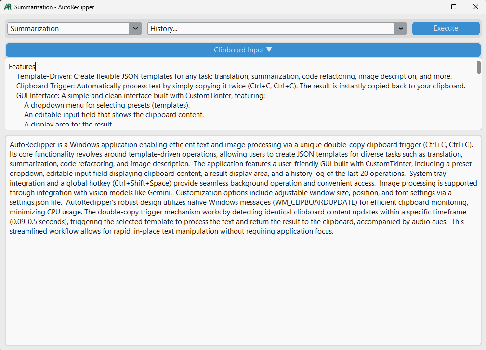

# AutoReclipper

Умная утилита для буфера обмена, которая автоматизирует обработку текста и изображений с помощью LLM, используя настраиваемые шаблоны.

---

- [Read in English](#-autoreclipper-en)
- [Читать на русском](#-autoreclipper-ru)

---

<a name="-autoreclipper-en"></a>

## 🇬🇧 AutoReclipper (English)


### Features

*   **Template-Driven**: Create flexible JSON templates for any task: translation, summarization, code refactoring, image description, and more.
*   **Clipboard Trigger**: Automatically process text by simply copying it twice (`Ctrl+C`, `Ctrl+C`). The result is instantly copied back to your clipboard.
*   **GUI Interface**: A simple and clean interface built with CustomTkinter, featuring:
    *   A dropdown menu for selecting presets (templates).
    *   An editable input field that shows the clipboard content.
    *   A display area for the result.
    *   A history of the last 20 operations.
*   **System Tray Integration**: Hide the application window to the system tray to keep it running in the background without cluttering your workspace.
*   **Global Hotkey**: Show or hide the application window from anywhere using a global hotkey (`Ctrl+Shift+Space`).
*   **Image Support**: Process images directly from the clipboard using vision-capable models like Gemini.
*   **Customizable**: Easily configure window size, position, and font settings via a `settings.json` file.
*   **Robust and Efficient**: Uses native Windows messages (`WM_CLIPBOARDUPDATE`) for efficient clipboard monitoring without unnecessary CPU load.

### How It Works: The "Double Copy" Magic

The core feature of AutoReclipper is its ability to trigger actions without needing to focus the application window.

1.  **The Action**: In any application (a browser, code editor, messenger), select a piece of text and press `Ctrl+C` twice in quick succession.
2.  **The Mechanism**: The application listens for the `WM_CLIPBOARDUPDATE` system message from Windows.
3.  **The Logic**: When a clipboard update occurs, the app checks two conditions:
    *   Is the new clipboard content identical to the previous content?
    *   Did this update happen within a specific time window (between 0.09 and 0.5 seconds after the previous one)?
4.  **The Result**: If both conditions are met, AutoReclipper takes the text from the clipboard, processes it using the currently selected template, and automatically copies the result back to your clipboard. A brief sound signal indicates the start and end of the operation.

This workflow allows for incredibly fast, in-place text processing.

### Installation

1.  **Prerequisites**: Ensure you have Python 3.9+ installed.
2.  **Clone the repository**:
    ```bash
    git clone https://github.com/your-username/AutoReclipper.git
    cd AutoReclipper
    ```
3.  **Create a virtual environment** (recommended):
    ```bash
    python -m venv .venv
    # On Windows
    .\\.venv\\Scripts\\activate
    # On macOS/Linux
    source .venv/bin/activate
    ```
4.  **Install dependencies**:
    ```bash
    pip install -r requirements.txt
    ```
    The required libraries are: `customtkinter`, `loguru`, `python-dotenv`, `google-generativeai`, `pyperclip`, `Pillow`, `pystray`, `pywin32`, `pynput`.

### Configuration

1.  **API Key**:
    *   This application requires a Google Gemini API key. You can obtain a free key from **[Google AI Studio](https://aistudio.google.com/app/apikey)**.
    *   Create a file named `.env` in the root directory of the project.
    *   Add your Gemini API key to this file:
      ```
      GEMINI_API_KEY=YOUR_API_KEY_HERE
      ```
2.  **Application Settings (`settings.json`)**:
    *   This file is created automatically on the first run.
    *   You can manually edit it to change the window geometry, last used template, and font settings (`font_family`, `font_size`).

### Usage

1.  **Run the application**:
    *   For development (with a console window): `python main.py`
    *   For regular use (without a console window): `pythonw main.pyw` (rename `main.py` to `main.pyw`).
2.  **Select a preset** from the top-left dropdown menu.
3.  **Trigger an action**:
    *   **Method 1 (Double Copy)**: Copy the same text twice from any application.
    *   **Method 2 (Manual)**: Paste or type text into the "Clipboard Input" field and click "Execute".
4.  **Global Hotkey**: Press `Ctrl+Shift+Space` to hide the window to the system tray or show it again.
5.  **System Tray**: Right-click the tray icon to "Show" the window or "Exit" the application.

### Creating Prompt Templates

Templates are the heart of AutoReclipper. They are simple JSON files located in the `templates/` directory.

Each template file must contain the following keys:

*   `name` (string): The name that will appear in the dropdown menu (e.g., "Translate to Japanese").
*   `description` (string): A short description of what the template does.
*   `api_provider` (string): The LLM provider to use. Currently, only `"gemini"` is supported.
*   `model` (string): The specific model name (e.g., `"gemini-1.5-flash"`).
*   `input_type` (string): The type of content the template expects. Can be `"text"` or `"image"` (Image mode is currently disabled).
*   `prompt` (string): The full prompt to be sent to the LLM. Use the placeholder `"{clipboard_text}"` where the clipboard text should be inserted.

**Example: `templates/code_commenter.json`**
```json
{
  "name": "Add Code Comments (EN)",
  "description": "Analyzes a code snippet and adds explanatory comments.",
  "api_provider": "gemini",
  "model": "gemini-1.5-flash",
  "input_type": "text",
  "prompt": "You are an expert programmer. Analyze the following code snippet and add clear, concise comments explaining what each part does. Return only the commented code, without any additional explanations or markdown formatting.\\n\\nCode:\\n```\\n{clipboard_text}\\n```"
}
```

### Practical Use Case: Translating Code Comments

Imagine you are working with legacy code that has comments in a foreign language. You need to translate them to English one by one.

**Workflow with AutoReclipper:**

1.  In the AutoReclipper window, select your "Translate Cyr<->Eng" preset.
2.  Switch to your code editor.
3.  Select a comment you want to translate.
4.  Press `Ctrl+C` twice quickly.
5.  Wait for the "out" sound signal (about 1-2 seconds). The translated text is now in your clipboard.
6.  Press `Ctrl+V` to paste the English comment, replacing the original.
7.  Repeat for the next comment.

This workflow is incredibly fast for processing many small, separate pieces of text without ever leaving your primary application.

---

<a name="-autoreclipper-ru"></a>

## 🇷🇺 AutoReclipper (Русский)

### Возможности

*   **Работа по шаблонам**: Создавайте гибкие JSON-шаблоны для любых задач: перевод, суммаризация, рефакторинг кода, описание изображений и многого другого.
*   **Активация через буфер обмена**: Автоматически обрабатывайте текст, просто скопировав его дважды (`Ctrl+C`, `Ctrl+C`). Результат мгновенно копируется обратно в буфер обмена.
*   **Графический интерфейс**: Простой и понятный интерфейс, созданный с помощью CustomTkinter, включает:
    *   Выпадающее меню для выбора пресетов (шаблонов).
    *   Редактируемое поле ввода, отображающее содержимое буфера обмена.
    *   Область для вывода результата.
    *   Историю последних 20 операций.
*   **Интеграция с системным треем**: Скрывайте окно приложения в системный трей, чтобы оно работало в фоне, не загромождая рабочее пространство.
*   **Глобальная горячая клавиша**: Показывайте или скрывайте окно приложения из любого места с помощью глобальной горячей клавиши (`Ctrl+Shift+Space`).
*   **Поддержка изображений**: Обрабатывайте изображения прямо из буфера обмена с помощью vision-моделей, таких как Gemini.
*   **Гибкая настройка**: Легко настраивайте размер и положение окна, а также параметры шрифта через файл `settings.json`.
*   **Надежность и эффективность**: Использует нативные сообщения Windows (`WM_CLIPBOARDUPDATE`) для эффективного мониторинга буфера обмена без лишней нагрузки на процессор.

### Как это работает: магия "двойного копирования"

Ключевая особенность AutoReclipper — это возможность запускать действия, не переключаясь на окно приложения.

1.  **Действие**: В любом приложении (браузере, редакторе кода, мессенджере) выделите фрагмент текста и быстро нажмите `Ctrl+C` два раза подряд.
2.  **Механизм**: Приложение прослушивает системное сообщение `WM_CLIPBOARDUPDATE` от Windows.
3.  **Логика**: При обновлении буфера обмена приложение проверяет два условия:
    *   Совпадает ли новое содержимое буфера с предыдущим?
    *   Произошло ли это обновление в определенном временном окне (между 0.09 и 0.5 секунды после предыдущего)?
4.  **Результат**: Если оба условия выполнены, AutoReclipper забирает текст из буфера, обрабатывает его с помощью текущего выбранного шаблона и автоматически копирует результат обратно в буфер обмена. Короткий звуковой сигнал оповещает о начале и конце операции.

Этот процесс позволяет невероятно быстро обрабатывать текст "на месте".

### Установка

1.  **Требования**: Убедитесь, что у вас установлен Python 3.9+.
2.  **Клонируйте репозиторий**:
    ```bash
    git clone https://github.com/your-username/AutoReclipper.git
    cd AutoReclipper
    ```
3.  **Создайте виртуальное окружение** (рекомендуется):
    ```bash
    python -m venv .venv
    # Для Windows
    .\\.venv\\Scripts\\activate
    # Для macOS/Linux
    source .venv/bin/activate
    ```
4.  **Установите зависимости**:
    ```bash
    pip install -r requirements.txt
    ```
    Необходимые библиотеки: `customtkinter`, `loguru`, `python-dotenv`, `google-generativeai`, `pyperclip`, `Pillow`, `pystray`, `pywin32`, `pynput`.

### Настройка

1.  **API ключ**:
    *   Для работы приложения необходим API-ключ от Google Gemini. Вы можете бесплатно получить его в **[Google AI Studio](https://aistudio.google.com/app/apikey)**.
    *   Создайте файл с именем `.env` в корневой папке проекта.
    *   Добавьте в него ваш API-ключ от Gemini:
      ```
      GEMINI_API_KEY=ВАШ_API_КЛЮЧ_ЗДЕСЬ
      ```
2.  **Настройки приложения (`settings.json`)**:
    *   Этот файл создается автоматически при первом запуске.
    *   Вы можете редактировать его вручную, чтобы изменить геометрию окна, последний использованный шаблон и настройки шрифта (`font_family`, `font_size`).

### Использование

1.  **Запустите приложение**:
    *   Для разработки (с окном консоли): `python main.py`
    *   Для обычного использования (без окна консоли): `pythonw main.pyw` (переименуйте `main.py` в `main.pyw`).
2.  **Выберите пресет** из выпадающего меню в левом верхнем углу.
3.  **Запустите действие**:
    *   **Способ 1 (Двойное копирование)**: Скопируйте один и тот же текст дважды из любого приложения.
    *   **Способ 2 (Вручную)**: Вставьте или напишите текст в поле "Clipboard Input" и нажмите "Execute".
4.  **Глобальная горячая клавиша**: Нажмите `Ctrl+Shift+Space`, чтобы скрыть окно в трей или показать его снова.
5.  **Системный трей**: Нажмите правой кнопкой мыши на иконку в трее, чтобы "Показать" окно или "Выйти" из приложения.

### Создание шаблонов промптов

Шаблоны — это сердце AutoReclipper. Это простые JSON-файлы, расположенные в папке `templates/`.

Каждый файл шаблона должен содержать следующие ключи:

*   `name` (строка): Имя, которое будет отображаться в выпадающем меню (например, "Перевести на японский").
*   `description` (строка): Краткое описание того, что делает шаблон.
*   `api_provider` (строка): Провайдер LLM. В настоящее время поддерживается только `"gemini"`.
*   `model` (строка): Конкретное имя модели (например, `"gemini-1.5-flash"`).
*   `input_type` (строка): Тип контента, который ожидает шаблон. Может быть `"text"` или `"image"`.
*   `prompt` (строка): Полный промпт, который будет отправлен в LLM. Используйте плейсхолдер `"{clipboard_text}"` в том месте, куда должен быть вставлен текст из буфера обмена.

**Пример: `templates/code_commenter.json`**
```json
{
  "name": "Добавить комментарии к коду (RU)",
  "description": "Анализирует фрагмент кода и добавляет поясняющие комментарии.",
  "api_provider": "gemini",
  "model": "gemini-1.5-flash",
  "input_type": "text",
  "prompt": "Ты — программист-эксперт. Проанализируй следующий фрагмент кода и добавь понятные, краткие комментарии, объясняющие, что делает каждая часть. Верни только код с комментариями, без дополнительных объяснений или markdown-форматирования.\\n\\nКод:\\n```\\n{clipboard_text}\\n```"
}
```

### Практический пример: перевод комментариев в коде

Представьте, что вы работаете с унаследованным кодом, в котором комментарии написаны на иностранном языке. Вам нужно перевести их на русский один за другим.

**Процесс работы с AutoReclipper:**

1.  В окне AutoReclipper выберите ваш пресет "Translate Cyr<->Eng".
2.  Переключитесь в ваш редактор кода.
3.  Выделите комментарий, который хотите перевести.
4.  Нажмите `Ctrl+C` два раза подряд.
5.  Подождите звукового сигнала об окончании (около 1-2 секунд). Переведенный текст теперь находится в вашем буфере обмена.
6.  Нажмите `Ctrl+V`, чтобы вставить русский комментарий вместо оригинального.
7.  Повторите для следующего комментария.

Этот процесс невероятно быстр для обработки множества небольших, отдельных фрагментов текста, при этом вам даже не нужно покидать основное приложение.
